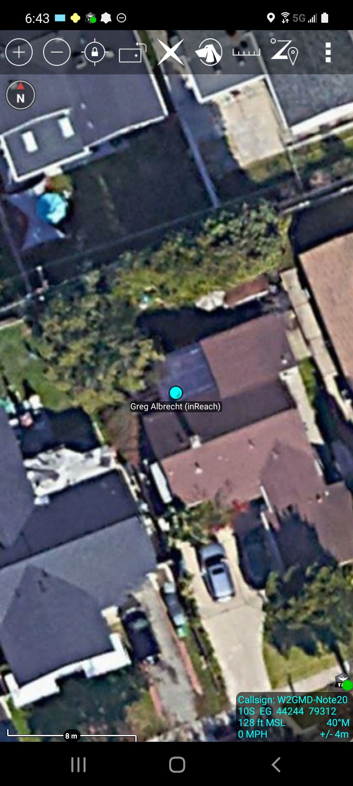

inrcot - Garmin inReach to Cursor-on-Target Gateway.
****************************************************

IF YOU HAVE AN URGENT OPERATIONAL NEED: Email ops@undef.net or call/sms +1-415-598-8226

The ``inrcot`` inReach to Cursor-on-Target Gateway transforms Garmin inReach
position messages into Cursor on Target (CoT) Position Location Information
(PLI) Points for display on Situational Awareness (SA) applications such as the
Android Team Awareness Kit (ATAK), WinTAK, RaptorX, COPERS, et al.

Possible use-cases include tracking Search & Rescue (SAR) operators, or
integrating Partner Forces location data into existing SA infrastructure
without exposing private network elements.

``inrcot`` can be run as a foreground command line application, but should be
run as a service with tools like systemd or `supervisor <http://supervisord.org/>`_

Usage of this program requires a `Garmin inReach <https://discover.garmin.com/en-US/inreach/personal/>`_ device with service.

Support inrcot Development
============================

inrcot has been developed for the Disaster Response, Public Safety and
Frontline community at-large. This software is currently provided at no-cost to
our end-users. All development is self-funded and all time-spent is entirely
voluntary. Any contribution you can make to further these software development
efforts, and the mission of inrcot to provide ongoing SA capabilities to our
end-users, is greatly appreciated:

.. image:: https://www.buymeacoffee.com/assets/img/custom_images/orange_img.png
    :target: https://www.buymeacoffee.com/ampledata
    :alt: Support inrcot development: Buy me a coffee!

Wildland Firefighting
=====================

``inrcot`` may also be of use in wildland firefighting, see Section 1114.d of
the `Dingell Act <https://www.congress.gov/bill/116th-congress/senate-bill/47/text>`_::

    Location Systems for Wildland Firefighters.--
    (1) In general.--Not later than 2 years after the date of
        enactment of this Act, subject to the availability of
        appropriations, the Secretaries, in coordination with State
        wildland firefighting agencies, shall jointly develop and
        operate a tracking system (referred to in this subsection as the
        ``system'') to remotely locate the positions of fire resources
        for use by wildland firefighters, including, at a minimum, any
        fire resources assigned to Federal type 1 wildland fire incident
        management teams.

Installation
============

The Garmin inReach to Cursor on Target Gateway is provided by a command-line
tool called `inrcot`:

Installing as a Debian/Ubuntu Package::

    $ wget https://github.com/ampledata/pytak/releases/latest/download/python3-pytak_latest_all.deb
    $ sudo apt install -f ./python3-pytak_latest_all.deb
    $ wget https://github.com/ampledata/adsbxcot/releases/latest/download/python3-inrcot_latest_all.deb
    $ sudo apt install -f ./python3-inrcot_latest_all.deb

Install from the Python Package Index (PyPI)::

    $ pip install inrcot

Install from this source tree::

    $ git clone https://github.com/ampledata/inrcot.git
    $ cd inrcot/
    $ python setup.py install

Setup
=====

``inrcot`` uses the Garmin Explore "MapShare" feature.

1. Login to Garmin Explore: https://explore.garmin.com/
2. Browse to the "MY INFO" page: https://explore.garmin.com/Inbox
3. Click "Social".
4. Under MapShare > Enable MapShare click to enable 'MapShare: On'.
5. Click "Feeds" and note the "Raw KML Data" URL, we'll use this URL.

For more information on inReach KML Feeds see: https://support.garmin.com/en-US/?faq=tdlDCyo1fJ5UxjUbA9rMY8

Usage
=====

The `inrcot` program has one command-line argument::

    $ inrcot -h
    usage: inrcot [-h] [-c CONFIG_FILE]

    optional arguments:
      -h, --help            show this help message and exit
      -c CONFIG_FILE, --CONFIG_FILE CONFIG_FILE

You must create a configuration file, see `example-config.ini` in the source
respository.

An example config::

    [inrcot]
    COT_URL = tcp:takserver.example.com:8088
    POLL_INTERVAL = 120

    [inrcot_feed_aaa]
    FEED_URL = https://share.garmin.com/Feed/Share/aaa

Multiple feeds can be added by creating multiple `inrcot_feed` sections::

    [inrcot]
    COT_URL = tcp:takserver.example.com:8088
    POLL_INTERVAL = 120

    [inrcot_feed_xxx]
    FEED_URL = https://share.garmin.com/Feed/Share/xxx

    [inrcot_feed_yyy]
    FEED_URL = https://share.garmin.com/Feed/Share/yyy

Individual feeds CoT output can be customized as well::

    [inrcot]
    COT_URL = tcp:takserver.example.com:8088
    POLL_INTERVAL = 120

    [inrcot_feed_zzz]
    FEED_URL = https://share.garmin.com/Feed/Share/zzz
    COT_TYPE = a-f-G-U-C
    COT_STALE = 600
    COT_NAME = Team Lead
    COT_ICON = my_package/team_lead.png

Source
======
Github: https://github.com/ampledata/inrcot

Author
======
Greg Albrecht W2GMD oss@undef.net

https://ampledata.org/

Copyright
=========
Copyright 2021 Greg Albrecht

License
=======
Apache License, Version 2.0. See LICENSE for details.
